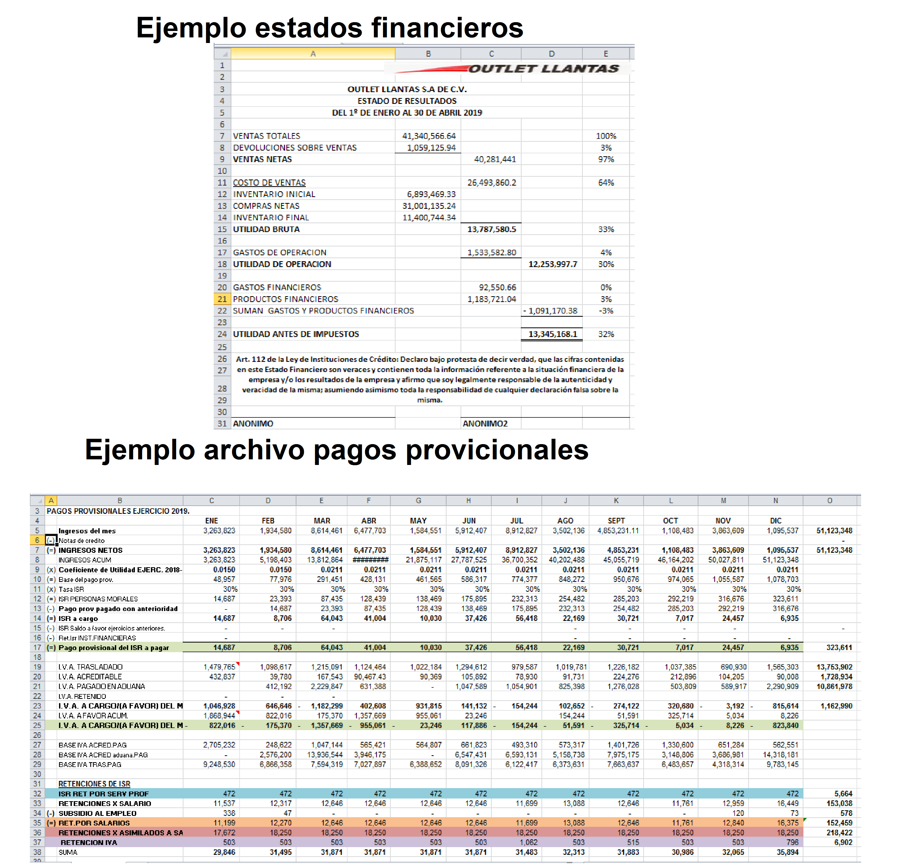
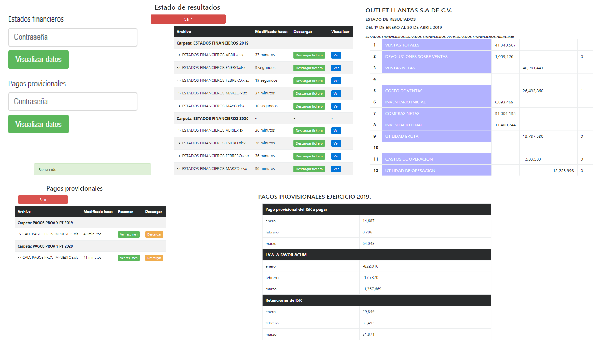

<h1>Lectura de archivos xls y xlsx con la libreria PHPExcel</h1>
<small><i>Por motivos de seguridad los datos presentados en los archivos de excel estan basados en formatos reales pero no contienen información real por lo que todos los numeros fueron alterados antes de realizar la carga de archivos</i></small>

<h4>Ejemplo de archivos de excel a leer</h4>

<h4>Demo del sistema final</h4>

